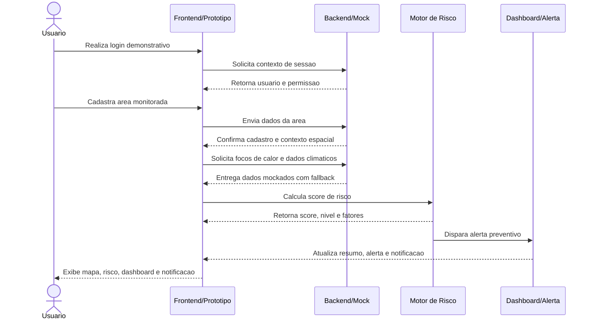
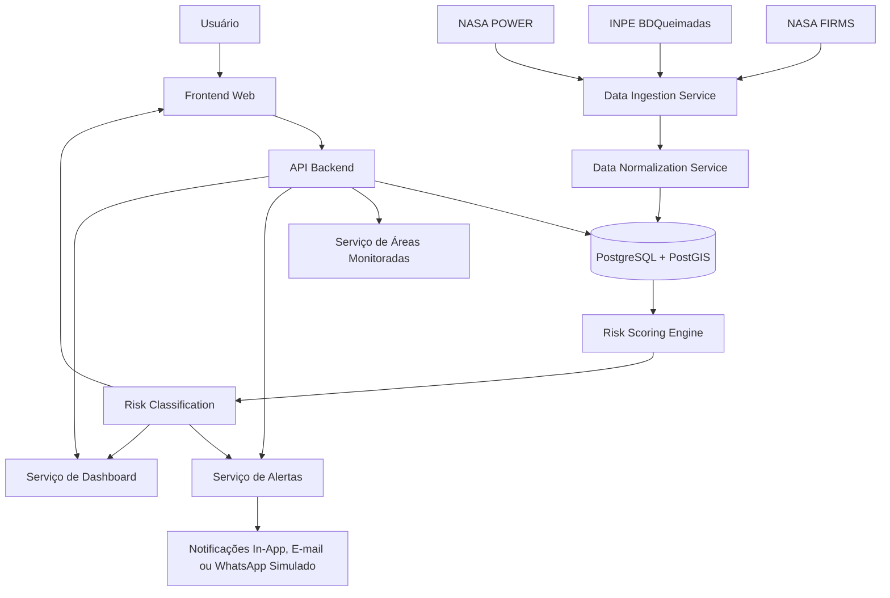

# OrbitGuard Fire

**Plataforma de Alerta Orbital Preventivo contra Queimadas e Risco Climático**

O **OrbitGuard Fire** é uma solução digital para monitoramento preventivo de queimadas que combina **dados orbitais**, **dados climáticos**, **geolocalização** e um **motor explicável de risco** para apoiar comunidades, pequenos produtores rurais, escolas, cooperativas, empresas e gestores públicos na tomada de decisão antes que focos de calor evoluam para desastres ambientais.

A proposta é transformar dados técnicos de fontes como **NASA FIRMS**, **NASA POWER** e **INPE BDQueimadas** em **alertas simples, mapas de risco, recomendações práticas e dashboards operacionais**.

---

## 1. Visão do Produto

Queimadas e incêndios ambientais podem gerar perdas humanas, ambientais, econômicas e produtivas. Apesar de existirem bases públicas com dados de satélite e clima, essas informações geralmente são técnicas, fragmentadas e pouco acessíveis para usuários locais.

O **OrbitGuard Fire** resolve esse problema ao oferecer uma plataforma que:

- cadastra áreas geográficas monitoradas;
- identifica focos de calor próximos;
- consulta ou simula variáveis climáticas relevantes;
- calcula um score de risco de queimadas;
- emite alertas preventivos;
- explica os fatores que elevaram o risco;
- recomenda ações práticas;
- consolida informações em um dashboard gerencial.

> **Proposta de valor:** transformar dados orbitais e climáticos complexos em alertas preventivos simples, compreensíveis e acionáveis.

---

## 2. Público-alvo

### Público principal

- Pequenos produtores rurais;
- Comunidades próximas a áreas de vegetação;
- Escolas rurais;
- Cooperativas agrícolas.

### Público secundário

- Defesa Civil municipal;
- Prefeituras;
- Gestores ambientais;
- Empresas com áreas rurais ou ambientais;
- Seguradoras rurais;
- ONGs ambientais;
- Equipes de logística em regiões vulneráveis.

---

## 3. Objetivo do MVP

O MVP tem como objetivo demonstrar, de forma simples e defensável, que é possível usar dados espaciais e climáticos para gerar alertas preventivos contra queimadas.

Fluxo principal do MVP:

```text
Cadastrar área monitorada
        ↓
Visualizar área no mapa
        ↓
Identificar focos de calor próximos
        ↓
Consultar dados climáticos
        ↓
Calcular score de risco
        ↓
Gerar alerta preventivo
        ↓
Exibir recomendações e dashboard
```

---

## 4. Funcionalidades do Protótipo

O protótipo navegável representa o fluxo principal da solução com dados simulados e telas demonstrativas.

### Telas incluídas

1. **Landing Page**  
   Apresenta a proposta de valor do OrbitGuard Fire.

2. **Login / Entrada**  
   Simula o acesso do usuário à plataforma.

3. **Cadastro de Área Monitorada**  
   Permite cadastrar uma área com nome, tipo, coordenadas e raio de monitoramento.

4. **Cálculo de Risco**  
   Simula a consulta de focos de calor, dados climáticos e cálculo do score.

5. **Mapa de Risco**  
   Exibe área monitorada, raio de proteção, focos de calor próximos, legenda e variáveis ambientais.

6. **Detalhe do Alerta**  
   Explica o que foi detectado, por que o cenário é perigoso e o que o usuário deve fazer.

7. **Dashboard Gerencial**  
   Apresenta áreas prioritárias, alertas ativos, focos recentes, score médio e evolução do risco.

8. **Mobile / Notificação**  
   Demonstra como o usuário poderia receber um alerta preventivo em dispositivo móvel.

---

## 5. Fluxo do Usuario

O MVP foi pensado para conduzir o usuario por uma jornada simples e demonstrativa:

1. **Login demonstrativo** - o usuario entra na plataforma com uma sessao simplificada, preparada para evoluir para JWT.
2. **Cadastro de area** - o usuario informa nome, tipo, coordenadas e raio da area monitorada.
3. **Carregamento de mapa e contexto espacial** - o frontend exibe a area cadastrada, o raio de monitoramento e os elementos proximos relevantes.
4. **Calculo de risco** - o sistema combina focos de calor, dados climaticos e regras explicaveis para calcular o score.
5. **Geracao de alerta** - quando o risco atinge um limiar relevante, um alerta preventivo e criado com justificativa clara.
6. **Dashboard e notificacao** - o usuario acompanha o resumo operacional no dashboard e recebe a sinalizacao do alerta em formato visual/in-app.

---

## 6. Diagrama de Sequencia



---

## 7. Score de Risco Demonstrativo

O protótipo utiliza um cenário controlado para demonstrar o cálculo de risco.

### Exemplo de fatores utilizados

| Fator | Condição | Pontos |
|---|---|---:|
| Foco próximo | Foco de calor entre 5 e 10 km | +25 |
| Concentração de focos | 3 ou mais focos em 24h | +20 |
| Temperatura elevada | Temperatura acima de 32°C | +15 |
| Baixa umidade | Umidade abaixo de 30% | +20 |
| Ausência de chuva | Precipitação abaixo de 1 mm | +15 |
| **Total** |  | **95/100** |

### Classificação

| Score | Nível | Descrição |
|---:|---|---|
| 0–30 | LOW | Baixo |
| 31–60 | MODERATE | Moderado |
| 61–85 | HIGH | Alto |
| 86+ | CRITICAL | Crítico |

No cenário demonstrado, o risco calculado é:

```text
Score: 95/100
Nível: CRITICAL
Severidade: DANGER
```

---

## 8. Fontes de Dados Previstas

### NASA FIRMS

Uso previsto para detecção de focos de calor e anomalias térmicas por satélite.

- Dados globais de fogo ativo;
- Sensores como MODIS e VIIRS;
- Formatos como CSV, SHP, TXT e KML;
- Base para identificação de focos próximos às áreas cadastradas.

Referência: https://firms.modaps.eosdis.nasa.gov/api/

### NASA POWER

Uso previsto para enriquecimento climático e meteorológico.

Variáveis úteis para o motor de risco:

- temperatura;
- precipitação;
- velocidade do vento;
- umidade relativa, quando disponível por fonte complementar;
- radiação solar.

Referência: https://power.larc.nasa.gov/docs/services/api/temporal/daily/

### INPE BDQueimadas

Uso previsto como fonte nacional complementar para dados de queimadas no Brasil e América Latina.

- Filtros por município, estado, bioma e satélite;
- Validação narrativa para o contexto brasileiro;
- Complemento à base da NASA.

Referência: https://terrabrasilis.dpi.inpe.br/queimadas/bdqueimadas/

---

## 9. Stack Técnica Recomendada

### Frontend

| Tecnologia | Uso |
|---|---|
| React | Construção da interface web |
| TypeScript | Tipagem estática e maior segurança no desenvolvimento |
| Vite ou Next.js | Estruturação do frontend |
| Leaflet | Renderização de mapas interativos |
| OpenStreetMap | Camada base do mapa |
| Axios ou Fetch API | Comunicação com o backend |
| CSS Modules / Tailwind CSS | Estilização da interface |

### Backend

| Tecnologia | Uso |
|---|---|
| Node.js | Ambiente de execução |
| NestJS | Framework backend modular |
| TypeScript | Padronização entre frontend e backend |
| JWT | Autenticação e autorização |
| Class Validator | Validação de DTOs |
| Swagger / OpenAPI | Documentação dos contratos de API |

### Banco de Dados

| Tecnologia | Uso |
|---|---|
| PostgreSQL | Banco relacional principal |
| PostGIS | Consultas geoespaciais |
| TypeORM ou Prisma | ORM para acesso ao banco |
| UUID | Identificação única de entidades |

### Processamento e Jobs

| Tecnologia | Uso |
|---|---|
| node-cron | Agendamento simples no MVP |
| BullMQ | Filas e jobs assíncronos em evolução futura |
| Redis | Cache e suporte às filas em versões futuras |

### Deploy

| Camada | Opções recomendadas |
|---|---|
| Frontend | Vercel, Netlify |
| Backend | Render, Railway, Fly.io |
| Banco | Supabase, Neon, Railway PostgreSQL |
| Observabilidade | Logs estruturados, dashboards básicos e métricas de jobs |

---

## 10. Arquitetura Macro



---

## 11. Módulos do Backend

```text
backend/
├── auth/
├── users/
├── monitored-areas/
├── fire-events/
├── weather/
├── risk-engine/
├── alerts/
├── dashboard/
├── integrations/
│   ├── nasa-firms/
│   ├── nasa-power/
│   └── inpe/
└── jobs/
```

### Responsabilidades principais

| Módulo | Responsabilidade |
|---|---|
| Auth | Login, cadastro, JWT e controle de sessão |
| Users | Perfis de usuário e preferências |
| Monitored Areas | Cadastro e consulta de áreas monitoradas |
| Fire Events | Armazenamento e consulta de focos de calor |
| Weather | Armazenamento de snapshots climáticos |
| Risk Engine | Cálculo do score e classificação de risco |
| Alerts | Geração, listagem e leitura de alertas |
| Dashboard | Métricas agregadas e visão gerencial |
| Integrations | Integração com NASA, INPE e outras fontes |
| Jobs | Coleta periódica e recálculo de risco |

---

## 12. Modelo de Dados Principal

Entidades previstas:

```text
users
monitored_areas
fire_events
area_fire_events
weather_snapshots
risk_scores
risk_factors
alerts
```

### Relacionamentos principais

```text
User 1:N MonitoredArea
MonitoredArea 1:N WeatherSnapshot
MonitoredArea 1:N RiskScore
MonitoredArea 1:N Alert
MonitoredArea N:N FireEvent via AreaFireEvent
RiskScore 1:N RiskFactor
```

---

## 13. Principais Endpoints

### Autenticação

```http
POST /auth/register
POST /auth/login
```

### Áreas monitoradas

```http
POST /monitored-areas
GET /monitored-areas
GET /monitored-areas/{id}
```

### Focos de calor

```http
GET /monitored-areas/{id}/fire-events?periodHours=48
POST /fire-events/mock
```

### Clima

```http
GET /monitored-areas/{id}/weather/latest
GET /monitored-areas/{id}/weather/history?startDate=YYYY-MM-DD&endDate=YYYY-MM-DD
```

### Risco

```http
POST /monitored-areas/{id}/risk/calculate
GET /monitored-areas/{id}/risk/history
```

### Alertas

```http
GET /alerts
GET /alerts/{id}
PATCH /alerts/{id}/read
```

### Dashboard

```http
GET /dashboard/summary
GET /dashboard/map
```

---

## 14. Como Executar o Protótipo HTML

O protótipo atual é uma versão navegável estática em HTML, CSS e JavaScript puro.

### Opção 1 — Abrir diretamente

Abra o arquivo no navegador:

```text
prototypes/orbitguard-fire-prototipo-v2.html
```

### Opção 2 — Rodar com servidor local simples

Usando Python:

```bash
python -m http.server 5500
```

Depois acesse:

```text
http://localhost:5500/prototypes/orbitguard-fire-prototipo-v2.html
```

---

## 15. Estrutura Recomendada do Repositório

```text
orbitguard-fire/
├── frontend/
│   ├── src/
│   │   ├── pages/
│   │   ├── components/
│   │   ├── services/
│   │   ├── maps/
│   │   └── styles/
│   └── README.md
│
├── backend/
│   ├── src/
│   │   ├── auth/
│   │   ├── users/
│   │   ├── monitored-areas/
│   │   ├── fire-events/
│   │   ├── weather/
│   │   ├── risk-engine/
│   │   ├── alerts/
│   │   ├── dashboard/
│   │   ├── integrations/
│   │   └── jobs/
│   └── README.md
│
├── database/
│   ├── migrations/
│   ├── seeds/
│   └── schema.sql
│
├── docs/
│   ├── architecture.md
│   ├── api-contracts.md
│   ├── prototype-flow.md
│   └── pitch.md
│
├── prototypes/
│   └── orbitguard-fire-prototipo-v2.html
│
└── README.md
```

---

## 16. Estratégia de Dados do MVP

Para garantir estabilidade durante a demonstração, o MVP utiliza uma abordagem híbrida.

### Dados simulados/controlados

Usados para:

- garantir que o mapa sempre exiba focos de calor;
- controlar cenários de risco baixo, moderado, alto e crítico;
- evitar falhas por indisponibilidade de APIs externas;
- permitir apresentação offline ou com baixa dependência de internet.

### Integrações reais planejadas

A arquitetura está preparada para evoluir com:

- NASA FIRMS para focos de calor;
- NASA POWER para dados climáticos;
- INPE BDQueimadas para contexto nacional;
- PostGIS para consultas geoespaciais reais;
- jobs para ingestão e recálculo periódico de risco.

---

## 17. Segurança e Privacidade

O OrbitGuard Fire manipula dados de localização de áreas monitoradas. Portanto, a evolução do produto deve considerar:

- autenticação com JWT;
- senha com hash seguro;
- validação e sanitização de entradas;
- controle de acesso por usuário;
- consentimento explícito para uso de localização;
- restrição de visualização de áreas privadas;
- logs sem exposição de dados sensíveis;
- rate limit básico nas APIs.

---

## 18. Observabilidade

Eventos importantes para registrar:

```text
INFO  collect-fire-events started
INFO  fire events collected from NASA FIRMS
WARN  NASA POWER request timeout for area_id=...
INFO  risk_score calculated area_id=... score=95 level=CRITICAL
ERROR failed to persist fire_event external_id=...
```

Métricas recomendadas:

- quantidade de áreas monitoradas;
- quantidade de alertas ativos;
- áreas por nível de risco;
- focos detectados nas últimas 24h;
- tempo de resposta das integrações;
- falhas de ingestão;
- histórico de score por área.

---

## 19. Roadmap Técnico

### Fase 1 — Protótipo navegável

- Criar telas principais;
- Simular cadastro de área;
- Simular mapa com focos;
- Simular cálculo de risco;
- Simular alerta preventivo;
- Criar dashboard estático.

### Fase 2 — MVP funcional

- Implementar frontend em React;
- Implementar backend em NestJS;
- Criar banco PostgreSQL com PostGIS;
- Implementar APIs principais;
- Implementar Risk Engine;
- Integrar frontend e backend;
- Criar base mockada controlada.

### Fase 3 — Integrações reais

- Integrar NASA FIRMS;
- Integrar NASA POWER;
- Avaliar consumo do INPE BDQueimadas;
- Criar jobs de ingestão;
- Normalizar dados externos;
- Persistir histórico.

### Fase 4 — Alertas e inteligência

- Gerar alertas automáticos;
- Implementar notificação in-app;
- Simular e-mail ou WhatsApp;
- Melhorar explicabilidade do score;
- Ajustar regras por tipo de área.

### Fase 5 — Evolução

- Aplicar modelos preditivos;
- Criar aplicativo mobile;
- Integrar sensores locais;
- Integrar Defesa Civil;
- Adicionar relatórios ESG;
- Criar análise por bioma, município e período.

---

## 20. Critérios de Sucesso do MVP

O MVP será considerado bem-sucedido se demonstrar:

- cadastro de área monitorada;
- visualização da área em mapa;
- identificação de focos de calor próximos;
- uso de dados climáticos no cálculo;
- score de risco explicável;
- alerta preventivo gerado;
- recomendações práticas;
- dashboard com visão consolidada;
- conexão clara com dados espaciais reais.

---

## 21. Pitch Técnico

> O OrbitGuard Fire é uma plataforma de alerta preventivo que usa dados orbitais da NASA e do INPE, combinados com informações climáticas e um motor de risco explicável, para identificar ameaças de queimadas em áreas monitoradas. A solução transforma focos de calor, clima e geolocalização em alertas simples, recomendações práticas e dashboards para produtores, comunidades e gestores públicos.

---

## 22. Licença

Projeto acadêmico desenvolvido para fins educacionais e demonstrativos.

---

## 23. Status do Projeto

```text
Status: Protótipo navegável / MVP conceitual
Versão: 2.0
Foco atual: Demonstração do fluxo principal e validação da proposta
```
